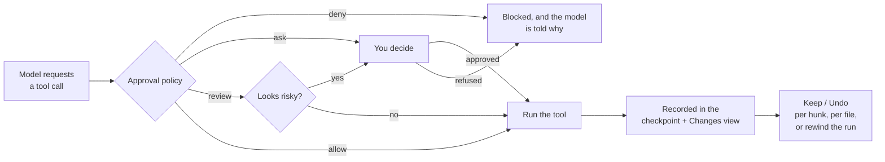
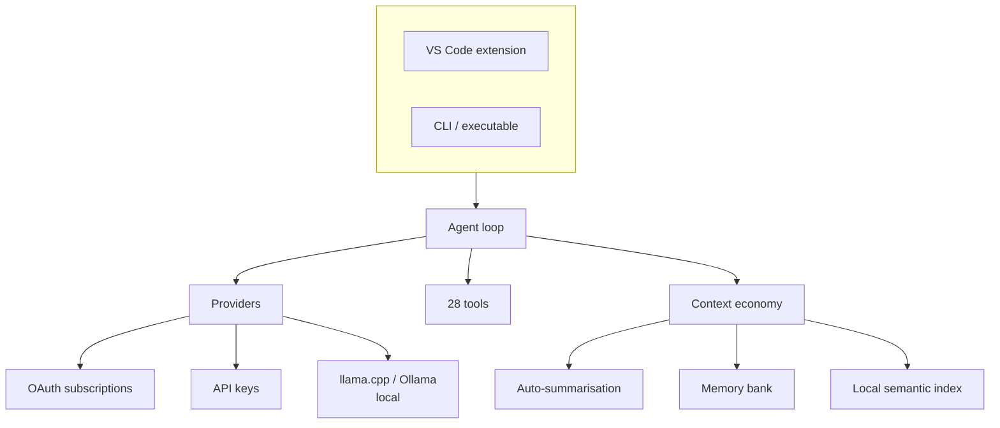

<div align="center">


# YargiX

### The open-source AI coding agent that runs on **your** machine

**Editor · Terminal · CI** — one agent, everywhere you work.

<br/>

[](LICENSE)
[](https://yargiengine.com)
[](https://t.me/YargiIde)
[](https://t.me/YARGI_LEAKS)


</div>

---

## What is this?

YargiX is an AI coding agent that lives in your editor, your terminal and your CI — **the same agent in all three**, not three different products wearing the same name.

It reads your workspace, edits files, runs commands, drives a real browser to check its own work, and searches your codebase by *meaning* rather than keywords. You can point it at a Claude / ChatGPT / Gemini subscription you already pay for, at any API key, or at a model running **entirely on your own machine** — no internet, no telemetry, no code leaving the building.

<br/>

## 🌟 What makes it different

<table>
<tr>
<td width="50%" valign="top">

### 🔌 Offline is a first-class path
**llama.cpp is built in.** Search Hugging Face for a GGUF model, pick a quantization, download — YargiX spawns and manages the server for you, with full control over context size, GPU layers, flash attention and KV cache types. Ollama is detected automatically.

The semantic index runs an **on-device ONNX model**, so indexing never ships your code anywhere.

</td>
<td width="50%" valign="top">

### ⏪ Nothing is irreversible
Four independent safety nets: per-hunk **Keep / Undo** on every edit, a **Changes** view for the whole run, **checkpoints** that rewind the entire workspace, and **shadow worktrees** for work you are not sure about.

Even the rewind can be undone — restoring takes a checkpoint of the current state first.

</td>
</tr>
<tr>
<td width="50%" valign="top">

### 👀 It can see what it built
The **Browser** tool drives a real Chrome or Edge over the DevTools Protocol: it opens your dev server, takes a screenshot the model actually looks at, clicks through a flow, and reports console errors.

No extra dependency, no 150 MB of bundled browser binaries — it uses the browser you already have.

</td>
<td width="50%" valign="top">

### 🧠 It remembers between sessions
`.yargix/memory/` holds notes the agent maintains: how the project builds, why a module is shaped the way it is, the trap that cost you an hour last week.

It is a normal folder in your repo — commit it and the whole team inherits the context.

</td>
</tr>
</table>

<br/>

## 🚀 Quick start

```bash
# 1. Install from the Marketplace, or build it yourself:
pnpm install && pnpm run compile

# 2. Press F5 in VS Code to launch the Extension Development Host
```

The **welcome guide opens on first run** and walks you through connecting a model — a subscription, an API key, or a fully local model.

Then: open the YargiX panel from the activity bar and ask something.

| Shortcut | Action |
|:--|:--|
| `Ctrl+L` / `Cmd+L` | Send the current selection to chat |
| `Ctrl+I` / `Cmd+I` | Rewrite the selection from a plain-language instruction |
| `Alt+Enter` | Apply and jump to the next related edit |
| `Alt+]` | Skip this related edit |

<br/>

## 🧭 Seven modes

Modes are not presets — they change which tools exist. A read-only mode cannot edit a file even if the model tries.

| Mode | What it is | Can edit? |
|:--|:--|:--:|
| **Agent** | Does the work: reads, edits, runs commands | ✅ |
| **Ask** | Answers questions about the codebase | ❌ |
| **Plan** | Writes a plan and **asks for your approval** before implementing | ❌ |
| **Debug** | Hypothesis → evidence → minimal fix → verify | ✅ |
| **Review** | Defect-first code review with severities and break scenarios | ❌ |
| **Multitask** | A coordinator that delegates to parallel subagents | ❌ *(delegates)* |
| **Project** | A **team lead** running 19 specialists | ❌ *(delegates)* |

**Project mode** dispatches a real crew — product manager, architect, explorer, UI/UX designer, frontend, backend, database engineer, DevOps, QA, code reviewer, security engineer, threat modeler and more. Each works in an isolated context and reports back with a structured handoff.

<br/>

## 🛡️ The safety model

An agent that edits your repository is only useful if you can trust it. YargiX is built around that, not around it.



- **Per-action policy** — `allow` / `ask` / `review` / `deny` for shell, edits, deletes, MCP, web and out-of-workspace access, each with wildcard allow and deny lists.
- **Risk heuristics** in review mode catch `rm -rf`, `sudo`, `.env`, private keys and credential files.
- **Chained commands are checked one at a time**, so a denied command cannot ride along behind an allowed one: `git add -A; git commit` is evaluated as two commands.
- **Plan approval gate** — leaving plan mode for a mode that can execute requires your sign-off. The agent cannot approve its own plan.
- **Nothing runs unattended in CI** without an explicit `--auto`.

<br/>

## 🛠️ 28 tools

<details>
<summary><b>Read &amp; search</b></summary>

`Read` · `ListDir` · `Glob` · `Grep` · `SemanticSearch` · `SearchDocs` · `FileSearch` · `ReadLints` · `ReadTerminal`

Semantic search finds code by meaning — *"where do we refresh the auth token?"* — using a local index that updates incrementally as you work.

</details>

<details>
<summary><b>Write &amp; run</b></summary>

`StrReplace` · `Write` · `Delete` · `EditNotebook` · `Shell` · `AwaitShell`

Shell commands stream their output live, run in the background when long, and can watch for a pattern in the output. Every write is recorded for review and checkpointing.

</details>

<details>
<summary><b>See &amp; remember</b></summary>

`Browser` · `Memory`

`Browser` opens pages, screenshots them for the model to read, clicks, types, evaluates JavaScript and reports console errors. `Memory` keeps durable project knowledge in `.yargix/memory/`.

</details>

<details>
<summary><b>Coordinate</b></summary>

`Task` · `TodoWrite` · `TodoRead` · `AskQuestion` · `WritePlan` · `SwitchMode`

`Task` launches subagents — in parallel, in the background, with their own models and isolated contexts.

</details>

<details>
<summary><b>Reach out</b></summary>

`WebSearch` · `WebFetch` · `CallMcpTool` · `FetchMcpResource` · `ListMcpResources`

YargiX is both an MCP **client** (with a curated one-click catalog) and an MCP **server**, so other editors can drive this workspace through its tools.

</details>

<br/>

## 🖥️ Terminal &amp; CI

The same agent, headless — sharing the extension's loop, tools and approval policy through a small editor shim.

```bash
yargix                                        # interactive session
yargix "explain what this project does" --mode ask
yargix "review the uncommitted changes" --mode review
yargix "fix the failing build" --auto --json  # for CI
yargix --file task.md --output answer.md --auto --timeout 600
yargix "compare these" --attach expected.json --attach got.json --mode review
cat prompt.txt | yargix --stdin --mode ask
```

| Flag | |
|:--|:--|
| `-i, --interactive` | Hold a session open instead of answering once |
| `-m, --mode <name>` | agent · ask · plan · debug · review · multitask · project |
| `--model` `--base-url` `--api-key` | Connection, or use the environment |
| `--anthropic` | Talk to the endpoint as an Anthropic Messages API |
| `-f, --file <path>` | Read the prompt from a file (`-` = stdin) |
| `--stdin` | Read the prompt from stdin (must be piped) |
| `-o, --output <path>` | Write the final answer to a file |
| `--system <text>` | Extra instructions for this run |
| `--system-file <path>` | Extra instructions from a file (merged with `--system`) |
| `--attach <path>` | Pin a file onto the first turn (repeatable, or `a,b`) |
| `--timeout <sec>` | Abort the run after this many seconds |
| `--auto` | Approve writes and commands without asking |
| `--json` | Newline-delimited JSON events |
| `-q, --quiet` | Only the final answer |
| `-C, --cwd <dir>` | Work in another directory |

In an **interactive session** approvals become a real question — and only an explicit `y` or `a` counts as consent. Pressing Enter refuses. `/save`, `/load` and `/export` persist the conversation as JSON or a markdown transcript under `.yargix/` (or a path you pass). `/system` sets extra instructions for the rest of the session. `/attach` pins files onto the next prompt the same way `--attach` does for a one-shot run.

In **unattended mode** anything that would ask is denied unless `--auto` is passed, so a pipeline never silently gains write access to a checkout.

**Environment:** `YARGIX_API_KEY` · `YARGIX_BASE_URL` · `YARGIX_MODEL`
**Exit codes:** `0` success · `1` agent error · `2` bad usage

There is also a **standalone executable** — no Node installation required:

```bash
pnpm run build:exe     # dist/yargix.exe (or dist/yargix)
```

<br/>

## 🏛️ How it works



The **context economy** is what makes long runs survive: history is summarised automatically as the window fills, with a cooldown so it never thrashes, a minimum-gain check so it never summarises for nothing, and a guaranteed trim so a request always fits. Tool schemas are counted against the budget too — an omission that quietly makes most agents optimistic by thousands of tokens.

If the active model dies mid-run — outage, quota, retired model — a **fallback chain** continues on the next configured model instead of losing the work.

<br/>

## ⚙️ Configuration

19 settings, all under `yargix.*`. The ones worth knowing:

| Setting | Default | |
|:--|:--|:--|
| `inlineCompletions.enabled` | `false` | Ghost-text autocomplete |
| `inlineCompletions.model` | *(chat model)* | Use a smaller/faster model for completions |
| `plan.requireApproval` | `true` | Plan mode needs your sign-off before executing |
| `agent.selfCheck` | `true` | Verify its own edits before finishing |
| `fallbackModels` | `[]` | Models to fall back to, in order |
| `mcpServer.enabled` | `false` | Expose YargiX's tools to other MCP clients |
| `browser.headless` | `true` | Turn off to watch the agent drive the page |
| `terminal.showFixButton` | `true` | Status-bar button for the last failed command |

<br/>

## 🏗️ Building

```bash
pnpm install
pnpm run compile          # type-check + lint + bundle
pnpm run watch            # rebuild on change

pnpm run test:unit        # 214 unit tests, no editor required
pnpm run vsix             # package the extension
pnpm run build:cli        # bundle the CLI
pnpm run build:exe        # standalone executable
```

Unit tests run under plain Node with the `vscode` API stubbed, so they need no editor download and finish in under a second. Integration tests that need the real API live behind `pnpm run test:integration`.

CI runs type-check, lint, tests, both builds and a CLI smoke test on **Ubuntu and Windows**.

<br/>

## 🤝 Contributing

Issues and pull requests are welcome. Before opening a PR, please make sure these pass:

```bash
pnpm run check-types && pnpm run lint && pnpm run test:unit
```

New behaviour should come with a test. The suite deliberately covers the parts that fail quietly — approval-policy bypasses, path traversal, protocol framing, model-output validation.

<br/>

## 💬 Community

<div align="center">

[](https://yargiengine.com)
[](https://t.me/YargiIde)
[](https://t.me/YARGI_LEAKS)

</div>

<br/>

## 📄 License

[MIT](LICENSE) © **Yargı Engine**

YargiX is a derivative work based on [OpenCursor](https://github.com/PawanOsman/OpenCursor) by Pawan Osman, used under the MIT License. The original copyright notice is retained in `LICENSE` and in the header of every inherited file, as that license requires.

<div align="center">
<br/>
<sub><b>Built to work when the internet does not.</b></sub>
</div>
